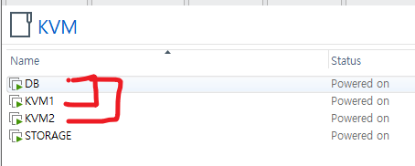
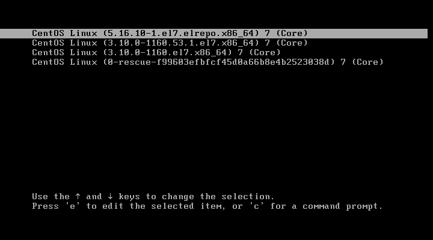
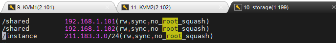

# Libvirt-tonyhan
<br>
Libvirt command list<br>

# System Settings
VMWare : KVM1(nfs-client), KVM2(nfs-client), DB<br>(nfs-server), STORAGE<br>
OS : CentOS:7<br>
Kernel Version: More than 5.16.10-1<br>
<br>

<br>
<br>

# Essential Part
## Update Kernel Version
<br>
<br>

You must update your CentOS Kernel Version and Run<br>
<br>
If you don't Please follow this order<br>

[https://cjwoov.tistory.com/48](https://cjwoov.tistory.com/48)<br>
<br>

## NFS Linking
System is must be like this<br>
<br>

<br>
if you don't follow this order<br>
<br>

1. install nfs-utils to ever VM<br>
`yum install -y nfs-utils`<br>

2. Make Your DB Settings<br>
```bash
mkdir /shared
chmod 777 /shared
vi /etc/exports
```
<br>

<br>
<br>

write list that you need to shared<br>
<br>

3. Mount Folder in KVM1, KVM2<br>
```bash
sudo mkdir /cloud
sudo mount -t nfs 192.168.1.199:/shared /cloud
```
<br>

192.168.1.199 can be your DB server IP<br>
<br>

Ok, Let's go<br>